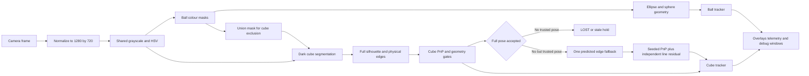
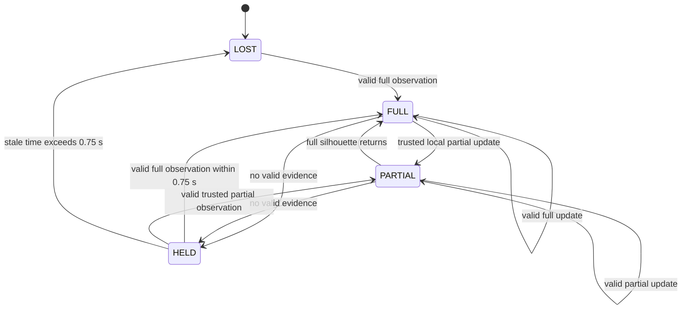
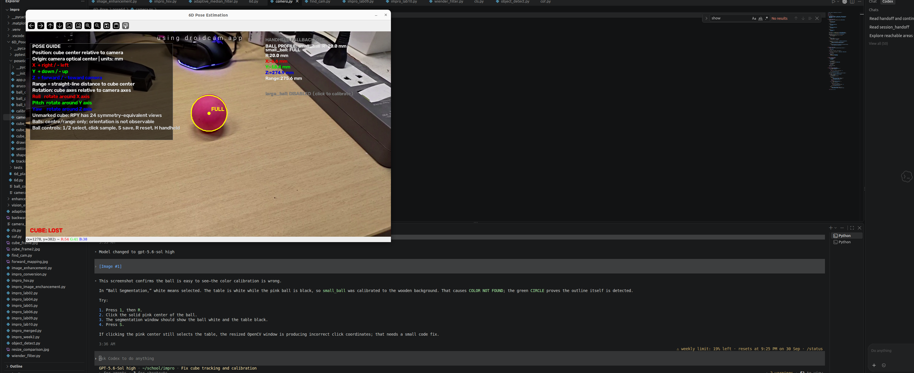
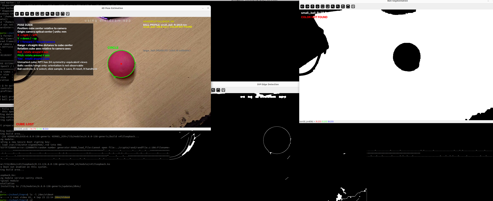
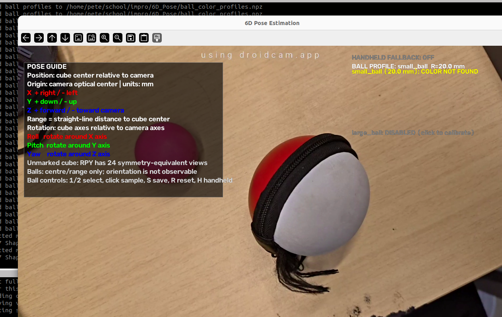

# Classical 6D Pose Estimation Mini Project

## A calibrated OpenCV system for cubes and spheres without machine learning

This report documents the `6D_Pose` mini project as implemented in the repository. The system estimates the pose of an unmarked cube and the position of two colour-identified spheres from ordinary camera frames. It uses classical digital image processing, calibrated projective geometry, and temporal tracking. No machine learning or deep learning model is used.

The central result is an interpretable pipeline: every pose is tied to a physical model, every candidate passes explicit geometry and motion gates, and every important failure is reported rather than hidden as a generic detection loss.

### Presentation summary

- **Problem:** recover object position and orientation from a normal camera without a trained model.
- **Method:** combine camera calibration, HSV and grayscale segmentation, morphology, contours, physical edge evidence, ellipse geometry, PnP, and temporal tracking.
- **Targets:** a 30 mm unmarked cube, a 20 mm-radius ball, a 37.5 mm-radius ball, and optional 40 mm ArUco markers.
- **Main contribution:** reject false partial cube poses by validating matched physical edges independently from the seeded PnP fit.
- **Result:** 14 automated tests pass; valid ball tracking is demonstrated at approximately 275.6 mm, while remaining live cube acceptance is documented explicitly.

### Contents

1. [Project goal and scope](#1-project-goal-and-scope)
2. [Classical computer vision theory](#2-classical-computer-vision-theory)
3. [Sphere geometry and calculations](#3-sphere-geometry-and-calculations)
4. [Cube model and pose estimation](#4-cube-model-and-pose-estimation)
5. [False tracking and partial cube protection](#5-false-tracking-and-partial-cube-protection)
6. [Transactional temporal tracking](#6-transactional-temporal-tracking)
7. [Runtime workflow and controls](#7-runtime-workflow-and-controls)
8. [Implementation record](#8-implementation-record)
9. [Verification results](#9-verification-results)
10. [Limitations and remaining live acceptance](#10-limitations-and-remaining-live-acceptance)
11. [Presentation outline and speaker notes](#11-presentation-outline-and-speaker-notes)
12. [Conclusion](#12-conclusion)
13. [References and project sources](#13-references-and-project-sources)
14. [Final presentation checklist](#appendix-a--final-presentation-checklist)

## 1 Project goal and scope

### 1.1 Problem statement

Many pose-estimation systems use trained object detectors or deep neural networks. For a small set of known objects, that approach introduces training data, model dependencies, and decisions that are difficult to inspect. This project asks whether calibrated geometry and classical digital image processing are sufficient for real-time pose estimation when object dimensions and useful visual properties are already known.

The practical difficulty is not only finding a dark or coloured region. A pose solver can return a numerically plausible answer for an incorrect correspondence. The system therefore has to prove that the observed silhouette, physical edges, dimensions, colour identity, range, and motion all agree before it commits a pose.

### 1.2 Objectives

1. Estimate the 3D centre and symmetry-relative rotation of an unmarked 30 mm cube.
2. Estimate the 3D centre and range of two colour-identified spheres without inventing a ball orientation.
3. Preserve ArUco pose estimation as a marked-object reference path.
4. Continue through brief camera drops and object occlusions without corrupting the trusted state.
5. Expose masks, fit metrics, status values, and rejection reasons for debugging and demonstration.
6. Use only classical image processing and projective geometry; no ML or DL model is permitted.

In this project, 6D pose means:

- three translations: `X`, `Y`, and `Z` relative to the camera;
- three rotations: roll about `X`, pitch about `Y`, and yaw about `Z`.

The cube is the true 6D target. It has a known side length and a visible orientation, so the application estimates translation and rotation. The balls are position targets. A featureless sphere has no body-fixed visual direction, so its orientation is not observable from a single colour silhouette. The application therefore reports a ball centre and straight-line range, and deliberately does not draw arbitrary ball axes.

The working configuration is:

| Item | Value |
|---|---|
| Camera frame | 1280 × 720 pixels |
| Requested frame rate | 30 frames per second |
| Cube model | Unmarked dark cube, 30 mm side |
| Small ball model | `small_ball`, 20.0 mm radius |
| Large ball model | `large_ball`, 37.5 mm radius |
| Ball acquisition range | 250–750 mm |
| Stale-pose hold | 0.75 seconds |
| Vision method | Thresholding, morphology, contours, edges, ellipse geometry, PnP, temporal gates |

The project keeps ArUco marker detection, camera recovery, calibration, generic shape overlays, segmentation windows, and persistent colour profiles active.

### 1.3 Acceptance criteria

| Requirement | Measurable criterion |
|---|---|
| Calibrated image geometry | Load the 1280 × 720 camera calibration and reject invalid calibration data. |
| Ball working range | Accept only approximately 250–750 mm and report `TOO CLOSE` or `TOO FAR` outside it. |
| Ball identity | Use the selected colour profile and configured radius; never switch radius from apparent size. |
| Full cube evidence | Require a valid dark silhouette, physical Canny support, PnP, and dense-hull agreement. |
| Partial cube evidence | Require a trusted pose, at least three matched edges, at least 35% perimeter coverage, and at most 3 px independent edge RMS. |
| Transactional tracking | A rejected observation must not modify the trusted raw pose, filtered pose, or accepted timestamp. |
| Occlusion behaviour | Show `HELD/STALE` for no more than 0.75 s and then transition to `LOST`. |
| Software regression | Pass all repository tests and compile in both Python environments. |

### 1.4 Processing architecture



The order is intentional. Ball masks are computed before cube morphology so even a rejected ball pose can protect cube acquisition from a ball or its shadow. Full cube detection is attempted before the local handheld fallback, and the fallback is invoked at most once per frame.

## 2 Classical computer vision theory

### 2.1 Coordinate frames and the pinhole camera

The camera coordinate frame uses `X` to the right, `Y` down, and positive `Z` forward from the optical centre. A 3D point is written as:

\[
\mathbf C = [X, Y, Z]^T.
\]

For a calibrated pinhole camera, the ideal pixel coordinates are:

\[
x = f_x\frac{X}{Z}+c_x, \qquad
y = f_y\frac{Y}{Z}+c_y,
\]

where `f_x` and `f_y` are focal lengths in pixels and `(c_x, c_y)` is the principal point. Depth cannot be recovered from one image coordinate alone. It is recovered by combining the projection model with known object geometry.

The application distinguishes optical-axis depth from straight-line range:

\[
\text{depth}=Z, \qquad
\text{range}=\sqrt{X^2+Y^2+Z^2}.
\]

For the demonstrated ball position `(-6.6, 18.4, 274.9) mm`, the calculated range is:

\[
\sqrt{(-6.6)^2+(18.4)^2+(274.9)^2}\approx275.59\text{ mm}.
\]

This agrees with the displayed range of 275.6 mm after rounding.

### 2.2 Camera calibration

The calibration tool detects a `7 × 7` inner-corner chessboard. Each square is 25 mm. Duplicate views are rejected using board centre, apparent area, and orientation. The final intrinsics and distortion coefficients are saved in `camera_calibration.npz`.

The loaded calibration is for the application’s 1280 × 720 working resolution:

\[
K =
\begin{bmatrix}
859.5877 & 0 & 663.0128\\
0 & 857.4726 & 344.3384\\
0 & 0 & 1
\end{bmatrix}.
\]

The five stored distortion coefficients are:

```text
[0.01102837, 0.03107245, 0.00111657, 0.00743369, -0.00443729]
```

The calibration contains 20 views, with an overall RMS reprojection error of `0.7382` pixels. The per-view errors range from `0.2374` to `1.5128` pixels. OpenCV uses these intrinsics and distortion values to undistort contour points before fitting and to reproject the recovered pose for validation.

The calibration is accepted only when focal lengths are positive, the matrix has the correct normalized final row, the principal point is plausible, all values are finite, the overall calibration RMS is at most 1.0 pixel when producing a new calibration, and no saved view exceeds 2.0 pixels. These checks prevent a malformed calibration file from silently producing misleading depth.

The meaning of the focal lengths, optical centre, calibration views, and distortion coefficients follows the [official OpenCV camera calibration model](https://docs.opencv.org/4.13.0/d4/d94/tutorial_camera_calibration.html).

### 2.3 HSV colour segmentation

Each enabled ball has an independent persistent HSV profile. Colour identifies the ball; apparent size never changes the configured radius.

For chromatic colours, hue is treated as circular on OpenCV’s `0–179` hue domain. The hue distance is:

\[
d_H = \min(|H-H_c|, 180-|H-H_c|).
\]

This prevents a colour near the red wraparound from being split into two unrelated ranges. The profile is sampled from a local patch around a user click. To preserve both a shaded limb and a bright highlight, the lower illumination bounds are one-sided:

\[
S \in [\max(0, P_5(S)-48), 255],
\]
\[
V \in [\max(0, P_5(V)-64), 255].
\]

Neutral profiles intentionally ignore hue and keep bounded saturation and value intervals. The binary mask is repaired with a `5 × 5` closing operation followed by a `3 × 3` opening operation. External contours are then tested against physical and geometric constraints.

### 2.4 Contours and shape gates

The ball path requires a dense contour with at least 20 points and at least 500 pixels of area. It rejects border-touching candidates, materially concave candidates, low-solidity candidates, poorly circular candidates, and extreme ellipse axis ratios. A small raster zipper gap can pass the solidity repair path without allowing a genuinely concave distractor through.

The full silhouette is fitted with an ellipse after undistortion. The resulting pose is accepted only if its reprojected limb agrees with the observed contour:

| Ball gate | Requirement |
|---|---:|
| Minimum area | 500 pixels |
| Minimum circularity | 0.25 |
| Maximum ellipse axis ratio | 4.0 |
| Maximum projected edge error | 8 pixels |
| Minimum convex-hull IoU | 0.72 |
| Accepted area ratio | 0.55 to 1.55 |

### 2.5 Morphological operations

Opening is erosion followed by dilation. It removes small foreground noise while retaining larger connected objects:

\[
A\circ B=(A\ominus B)\oplus B.
\]

Closing is dilation followed by erosion. It fills small gaps and holes:

\[
A\bullet B=(A\oplus B)\ominus B.
\]

The ball path closes before opening because a broken coloured limb is more damaging than a few isolated mask pixels. The cube path opens before closing because isolated dark texture should be removed before the cube silhouette is joined. These definitions follow the standard morphology operations described in the [OpenCV morphology documentation](https://docs.opencv.org/4.12.0/d9/d61/tutorial_py_morphological_ops.html).

### 2.6 Generic 2D shape detection

The generic shape path is a diagnostic overlay rather than the source of a 3D ball or cube pose. It applies grayscale conversion, a `5 × 5` Gaussian blur, Canny thresholds of 50 and 150, and two `5 × 5` closing iterations before extracting external contours. OpenCV represents a contour as the boundary points of a connected shape, as described in its [contour tutorial](https://docs.opencv.org/4.12.0/d4/d73/tutorial_py_contours_begin.html).

For each contour, circularity is:

\[
C=\frac{4\pi A}{P^2},
\]

where `A` is contour area and `P` is perimeter. A perfect continuous circle has `C = 1`; pixelation and irregular boundaries reduce the value. The generic circle overlay requires circularity above 0.78 and an ellipse axis ratio no greater than 1.15. Quadrilaterals are checked for convexity, right-angle cosine, and aspect ratio. A ball tracker can claim a generic contour so the interface does not draw duplicate `CIRCLE` labels over a calibrated ball.

### 2.7 ArUco reference path

The marked-object path uses `DICT_4X4_50`. An ArUco detector returns the marker ID and four ordered image corners. The project assigns a 40 mm square model with object coordinates:

```text
(-20, +20, 0) mm    (+20, +20, 0) mm
(-20, -20, 0) mm    (+20, -20, 0) mm
```

The four 3D-to-2D correspondences are solved with `SOLVEPNP_IPPE_SQUARE`, which is OpenCV’s planar square-marker pose method. The resulting Rodrigues rotation vector is converted to a rotation matrix and then to roll, pitch, and yaw. The translation vector is displayed in millimetres and axes are drawn because the binary marker code defines an observable orientation. OpenCV’s [ArUco detection documentation](https://docs.opencv.org/4.11.0/d5/dae/tutorial_aruco_detection.html) explains the candidate-square and binary-code stages, while the [PnP documentation](https://docs.opencv.org/4.12.0/d5/d1f/calib3d_solvePnP.html) defines `IPPE_SQUARE` and the required corner order.

### 2.8 Pose quality metrics

The report uses several metrics that measure different failure modes:

**RMS reprojection error** measures the paired distance between observed and projected feature points:

\[
e_{reproj}=\sqrt{\frac{1}{N}\sum_{i=1}^{N}\|\hat{u}_i-u_i\|^2}.
\]

**Intersection over union** measures silhouette overlap:

\[
IoU=\frac{|H_{observed}\cap H_{projected}|}{|H_{observed}\cup H_{projected}|}.
\]

**Area ratio** detects a projected silhouette that is too large or too small:

\[
q_A=\frac{A_{observed}}{A_{projected}}.
\]

**Independent edge residual** measures the normal distance from detected line samples to the projected cube edges after partial PnP:

\[
e_{edge}=\sqrt{\frac{1}{M}\sum_{j=1}^{M}d_{normal,j}^{2}}.
\]

Using point reprojection, silhouette overlap, area, and physical edge residual together prevents a single low residual from being treated as sufficient evidence.

## 3 Sphere geometry and calculations

### 3.1 Projected sphere size

For a sphere of physical radius `R` whose centre is approximately on the optical axis at distance `Z`, the exact tangent-circle radius in pixels is:

\[
r_{px} = \frac{fR}{\sqrt{Z^2-R^2}}.
\]

For the 20 mm ball at 500 mm, using the calibrated focal length `f ≈ 859.6 px`:

\[
r_{px} =
\frac{859.6 \times 0.020}{\sqrt{0.500^2-0.020^2}}
\approx 34.4\text{ px}.
\]

At 160 mm, the same ball projects to approximately 107.4 pixels in radius. It can therefore be visually obvious while still violating the physical range contract. The application reports `TOO CLOSE` and creates no trusted pose when the recovered range is below the valid interval.

For distances much larger than the radius, the expression reduces to the familiar approximation:

\[
r_{px} \approx fR/Z.
\]

### 3.2 Tangent-cone recovery

The fitted normalized ellipse defines a tangent-cone conic matrix `Q`. Its eigenvalues contain two same-sign values and one opposite-sign value. Let `λ_equal` be the average of the repeated-sign eigenvalues and `λ_single` be the opposite-sign eigenvalue. The implementation recovers the centre distance as:

\[
d = R\sqrt{1+\left|\frac{\lambda_{equal}}{\lambda_{single}}\right|}.
\]

The singleton eigenvector gives the centre ray. Its sign is chosen so that the recovered centre lies in front of the camera:

\[
\mathbf C = d\frac{\mathbf v_{single}}{\|\mathbf v_{single}\|},
\qquad C_z>0.
\]

The candidate then passes the hard range gate:

\[
0.250\text{ m} \le \|\mathbf C\| \le 0.750\text{ m}.
\]

The implementation uses a small 5 mm numerical allowance at the exact boundary to tolerate floating-point recovery error. Objects materially outside the range remain rejected.

### 3.3 Detailed ball reports

Each profile produces a detailed report containing:

- the selected profile and configured physical radius;
- the candidate pose, or `None`;
- the mask used for that profile;
- full or trusted partial mode;
- range and depth when geometry reached the range gate;
- circularity, axis ratio, edge error, IoU, area ratio, and other fit metrics;
- a status such as `FULL`, `PARTIAL/HANDHELD`, `TOO CLOSE`, `TOO FAR`, `OUTLINE REJECTED`, or `COLOR NOT FOUND`.

The original tuple-returning convenience APIs remain available for existing callers.

## 4 Cube model and pose estimation

### 4.1 Cube object model

The cube side is 30 mm and the model is centred at the object origin. Every vertex therefore has coordinates from:

\[
X,Y,Z \in \{-0.015, +0.015\}\text{ m}.
\]

For example, the eight vertices are combinations of `(±0.015, ±0.015, ±0.015)`. Centring the model makes the estimated translation represent the cube centre directly.

### 4.2 Full silhouette detection

The grayscale image is thresholded at intensity 100 to find dark cube material. A `3 × 3` opening removes isolated noise and a `7 × 7` closing joins the retained silhouette. Candidates are filtered by area, border contact, aspect ratio, fill ratio, convexity, and polygon approximation.

The candidate polygon must also have physical edge support. Each retained polygon edge is sampled against a Canny edge map within a 3 pixel band. The candidate requires at least 60 percent total boundary support and at least 35 percent support on every retained edge. This rejects soft shadows and rounded shadow blobs before PnP.

For each four-, five-, or six-point hypothesis, the solver estimates rotation `R` and translation `t` by minimizing:

\[
\min_{R,t}\sum_i
\left\|u_i-\operatorname{project}(K,RX_i+t)\right\|^2.
\]

Four-point face-on hypotheses use the planar IPPE alternatives. Five- and six-point hypotheses use iterative PnP; a SQPNP solution is used only as a five-point initializer when available. The final candidate must have positive depth for all eight cube vertices and must agree with the dense observed silhouette through reprojection, hull-edge, IoU, and area-ratio checks.

### 4.3 Cube symmetry

An unmarked cube has 24 proper rotational symmetries. A visually valid pose can therefore have multiple equivalent rotations. After a candidate passes the geometric gates, the implementation chooses the symmetry-equivalent rotation closest to the previous trusted orientation. If there is no previous pose, it chooses the equivalent with the smallest rotation-vector magnitude.

The user interface labels cube angles as relative roll, pitch, and yaw. These are stable symmetry-relative values, not a claim that a particular unmarked face is semantically unique.

## 5 False tracking and partial cube protection

### 5.1 Ball exclusion

The union of all enabled ball masks is passed to cube detection even when a ball pose is rejected. The exclusion mask is dilated by 3 pixels, removed before cube morphology, and removed again afterward. This prevents a dark ball or its shadow from being bridged into a dark cube candidate.

The debug cube mask is intentionally diagnostic rather than binary:

- rejected raw dark pixels are dim gray;
- contours that survive the preliminary cube gates are white;
- excluded ball pixels remain removed.

### 5.2 Predicted silhouette line matching

The normal `detect_cube` call performs only full-silhouette detection. The application may invoke the trusted local partial path once afterward. The partial path cannot acquire a cube globally because it requires a previous trusted pose.

The partial algorithm projects all eight cube vertices, forms their convex-hull silhouette cycle, and searches for line segments only inside a local predicted region of interest. Segments are matched one-to-one to predicted edges using these limits:

| Partial condition | Limit |
|---|---:|
| Segment angle error | ≤ 12° |
| Perpendicular distance | ≤ 6 pixels |
| Predicted-edge overlap | ≥ 25% |
| Matched edge count | ≥ 3 |
| Predicted perimeter coverage | ≥ 35% |
| Adjacent-edge vertex error | ≤ 10 pixels |
| Independent line residual after PnP | ≤ 3 pixels RMS |

A reliable vertex is formed only from the intersection of two adjacent matched edges. The seeded iterative PnP solve is then independently checked against the retained line samples. This independence is essential: three unrelated corners can fit a seeded PnP solve with a small reprojection error, but unrelated corners cannot normally reproduce the predicted physical edge directions, positions, overlap, and line residual at the same time.

## 6 Transactional temporal tracking

### 6.1 State and commit rule

Each ball profile and the cube have separate trusted state. A candidate is solved and validated before any state is changed. A rejected observation cannot mutate:

- the trusted raw pose;
- the filtered pose;
- `last_pose_time`;
- the stale timer;
- the previous reference used for local matching.

The cube tracker keeps both the last raw pose and a smoothed pose. Ball trackers do the same for each colour identity. Recalibrating one ball resets only that selected tracker; the other ball continues with its own trusted state.



`FULL` and `PARTIAL` transitions commit a newly validated pose. `HELD` displays the last trusted pose but does not treat it as a new measurement. `LOST` has no drawable pose and allows a fresh global acquisition.

### 6.2 Time-based smoothing

Accepted translations use exponential smoothing. Cube rotations use interpolation on `SO(3)`: the relative rotation is converted to a Rodrigues vector, scaled, and composed with the previous rotation. The time-dependent blend is:

\[
\alpha=1-e^{-\Delta t/\tau}.
\]

With `τ = 0.12 s` and `Δt = 1/30 s`:

\[
\alpha=1-e^{-0.0333/0.12}\approx 0.243.
\]

At nominal frame rate, the new accepted measurement contributes about 24 percent to the filtered state.

### 6.3 Motion and stale gates

The centre-speed gate is 1.0 m/s and the Z-speed gate is 0.75 m/s. At 30 fps, this corresponds to approximately 33.3 mm and 25.0 mm per frame. Cube rotation is limited to 360 degrees per second.

When valid evidence disappears, the last trusted pose may be displayed as `HELD/STALE` for at most 0.75 seconds, or approximately 22–23 frames at 30 fps. After that, the tracker clears its global reference and reports `LOST`. A rejected partial cube observation does not start or advance this timer by itself.

## 7 Runtime workflow and controls

### 7.1 Hardware and software environment

The implementation was verified in the following project environment. A different camera device can be used, but its resolution and calibration must match the values loaded by the program.

| Component | Verified configuration |
|---|---|
| Operating system and capture API | Linux with V4L2 |
| Camera device | `/dev/video4` |
| Camera source used in the demonstration | DroidCam |
| Working resolution | 1280 × 720 pixels |
| Requested capture format and rate | MJPG at 30 fps |
| Python | 3.10.12 in `vision_env` |
| OpenCV | 5.0.0 with the `aruco` module |
| NumPy | 2.2.6 |
| Learned model or training data | None |

From the repository, start the application with:

```bash
cd /home/pete/school/impro/6D_Pose
../vision_env/bin/python 6d.py
```

If the camera, focus, resolution, or lens arrangement has changed, perform camera calibration first:

```bash
cd /home/pete/school/impro/6D_Pose
../vision_env/bin/python 6d.py --calibrate
```

### 7.2 Camera calibration workflow

1. Print or display a rigid `8 × 8` square chessboard, which gives the required `7 × 7` inner corners, with each square measuring 25 mm.
2. Keep the capture resolution at 1280 × 720 and do not change digital zoom during or after calibration.
3. Move and tilt the board so that it covers the centre, sides, corners, near views, and farther views of the image.
4. Press `SPACE` to capture a sufficiently different valid view. Near-duplicate views are rejected automatically.
5. Collect the target 20 views. After at least 10 good views, `S` may save an early calibration; 20 diverse views are preferred.
6. Press `Q` or `Esc` to cancel without replacing the saved calibration.
7. Confirm that the reported overall RMS is at most 1.0 pixel and that no individual saved view exceeds 2.0 pixels.

The saved `camera_calibration.npz` contains the camera matrix, distortion coefficients, calibration resolution, view count, and error statistics. A calibration from another resolution or lens configuration is not interchangeable.

### 7.3 Ball calibration workflow

1. Press `1` or `2` to select the intended colour profile.
2. Click a solid middle-tone area inside the corresponding ball.
3. Inspect the Ball Segmentation window. The selected ball should be white and the background should be black.
4. Press `S` to save both profiles.
5. If the wrong object was sampled, press `R` and repeat the calibration.

The profile name and physical radius are shown in the main window. The ball mask window shows only the selected profile instead of OR-combining both profiles, which makes calibration errors visible.

### 7.4 Shortcut reference

| Control | Action |
|---|---|
| `1` | Select the `small_ball` colour profile with its 20.0 mm default radius. |
| `2` | Select the `large_ball` colour profile with its 37.5 mm default radius. |
| Left click | Sample a local HSV patch and reset only the selected ball tracker. |
| `S` | Save both profiles to `ball_color_profiles.npz`. |
| `R` | Reset and disable the selected ball profile. |
| `H` | Toggle handheld partial tracking. It is enabled by default in settings. |
| `Q` | Quit the application and close the OpenCV windows. |

Camera-calibration mode has its own controls:

| Calibration control | Action |
|---|---|
| `SPACE` | Capture the current chessboard view if it is valid and sufficiently different. |
| `S` | Solve and save early after at least 10 accepted views. |
| `Q` or `Esc` | Cancel calibration without replacing the existing file. |

## 8 Implementation record

| File or component | Work completed |
|---|---|
| `pose6d/settings.py` | Added physical constants, ball margins, range and stale limits, edge gates, exclusion dilation, and default-enabled handheld mode. |
| `pose6d/ball_detection.py` | Added persistent HSV profiles, hue wraparound, illumination headroom, sphere tangent-cone recovery, full and partial ball paths, range diagnostics, and detailed reports. |
| `pose6d/ball_pose.py` | Exported detailed ball APIs while retaining compatibility wrappers. |
| `pose6d/cube_detection.py` | Added optional ball exclusion, physical-edge support, filtered debug masks, predicted-hull line matching, and explicit partial diagnostics. |
| `pose6d/cube_pose.py` | Kept seeded local PnP but added independent matched-line validation and partial edge diagnostics. |
| `pose6d/tracking.py` | Added transactional ball and cube state, motion gates, smoothing, stale holding, status mapping, and selected-profile reset isolation. |
| `pose6d/app.py` | Integrated detailed ball reports, full-first cube detection, one partial fallback attempt, mask windows, telemetry, and shortcut help. |
| `pose6d/drawing.py` | Expanded the on-screen instruction guide so every shortcut is listed separately. |
| `tests/test_ball_tracking.py` | Covers calibrated sphere geometry, range status, profile persistence, hue wrapping, illumination variation, partial-ball rules, and transactional timeout behaviour. |
| `tests/test_cube_all_views.py` | Covers cube views, exclusion, clutter rejection, partial edge evidence, transaction safety, and timeout reset. |
| `6d_plan.md` | Records the project plan, follow-up defect analysis, assumptions, and acceptance targets. |

## 9 Verification results

Verification is divided into three evidence classes. **Automated regression tests** are repeatable repository tests. **Focused synthetic diagnostics** exercise one mathematical or image-processing property with generated inputs. **Live observations** come from the physical camera scene and demonstrate operation, but they are not a substitute for controlled ground-truth measurements.

### 9.1 Automated regression and compilation

| Evidence | Check | Result | What it establishes |
|---|---|---|---|
| Automated test | `python3 -m pytest -q` | **PASS — 14 passed** | All collected cube and ball regression tests pass. |
| Automated test | `python3 -m unittest discover -s tests -q` | **PASS — 14 tests OK** | The same test set passes through standard-library discovery. |
| Static check | `python3 -m py_compile 6d.py pose6d/*.py tests/*.py` | **PASS** | Source and test modules compile in the system Python environment. |
| Static check | `../vision_env/bin/python -m py_compile 6d.py pose6d/*.py tests/*.py` | **PASS** | The same modules compile in the camera environment. |
| Automated test | 20 mm sphere rendered at 160 mm | **`TOO CLOSE`; no pose committed** | The lower physical range limit is enforced explicitly. |
| Automated test | Textured no-cube frame at 45 distributed previous-pose locations | **0 partial accepts** | Background corners do not become a local cube pose. |
| Automated test | Partially occluded cube with aligned silhouette edges | **Accepted** | Partial refinement remains available when sufficient physical evidence is present. |
| Automated test | The same corners with edge support removed or tampered | **Rejected** | Seeded PnP cannot validate itself without independent edge evidence. |
| Automated test | Ball tracker rejection and timeout paths | **State remains transactional** | Rejected measurements do not refresh the trusted pose or stale timer. |

The current automated suite is concentrated on the cube and ball paths. ArUco behaviour and physical camera calibration are preserved and compile-tested, but a dedicated live ArUco accuracy series and camera-recovery endurance test remain future validation work.

### 9.2 Noise-free synthetic sphere accuracy

The sphere solver was also evaluated with analytically projected ellipses. The test camera used `f_x = f_y = 900 px`, the sphere centre was offset to `(35, -25, Z) mm`, and the input had no pixel noise, blur, segmentation error, or calibration error. The following results therefore validate the tangent-cone calculation itself; they are not a claim of micrometre accuracy in a live image.

| Radius | Optical depth `Z` | True range | Recovered centre error |
|---:|---:|---:|---:|
| 20.0 mm | 250 mm | 253.673 mm | 0.000003 mm |
| 20.0 mm | 500 mm | 501.847 mm | 0.000013 mm |
| 20.0 mm | 750 mm | 751.232 mm | 0.000001 mm |
| 37.5 mm | 250 mm | 253.673 mm | 0.000002 mm |
| 37.5 mm | 500 mm | 501.847 mm | 0.000015 mm |
| 37.5 mm | 750 mm | 751.232 mm | 0.000021 mm |

These near-zero errors are expected because the synthetic ellipse is generated from the same exact camera geometry that the inverse solver models. In practice, contour quantisation, imperfect radius measurement, lens calibration, occlusion, and colour segmentation dominate the error.

### 9.3 Focused cube pose diagnostic

A fresh diagnostic rendered the convex hull of a 30 mm cube at 350 mm depth, then passed the rasterised silhouette through the full cube detector using the saved camera calibration. Rotation error was measured modulo the cube’s 24 symmetries.

| Tilt | Polygon points | Centre error | RMS reprojection | Hull-edge error | Hull IoU | Symmetry-relative rotation error |
|---:|---:|---:|---:|---:|---:|---:|
| 0° | 4 | 1.254 mm | 0.095 px | 0.710 px | 0.9766 | 4.001° |
| 5° | 5 | 5.273 mm | 0.673 px | 1.591 px | 0.9707 | 3.151° |
| 10° | 6 | 0.820 mm | 0.474 px | 0.523 px | 0.9923 | 0.369° |
| 20° | 6 | 1.374 mm | 0.368 px | 0.724 px | 0.9819 | 2.057° |
| 45° | 6 | 10.770 mm | 1.549 px | 2.183 px | 0.9655 | 14.177° |
| 90° | 4 | 1.254 mm | 0.095 px | 0.710 px | 0.9766 | 4.001° |

This is a diagnostic rather than an automated acceptance test. It shows that silhouette-only cube accuracy varies strongly with view and rasterisation even when overlap remains high. The 45° result is the clearest limitation: good hull IoU does not guarantee precise depth or rotation. Physical edge evidence reduces false acceptance, but future work should add a controlled ground-truth cube dataset before claiming a general live accuracy figure.

### 9.4 Focused segmentation and exclusion checks

| Evidence | Result | Interpretation |
|---|---|---|
| Synthetic pink sphere with highlight and shade variation plus a differently hued shadow | Approximately **99.98% sphere-mask recovery** and **0% shadow admission** in the non-overlap check | The one-sided `S` and `V` upper bounds retain illumination variation while hue rejects the brown shadow. |
| Dark coloured sphere joined to a soft shadow | No accepted full or partial cube; no white candidate in the filtered cube debug mask | Ball-mask exclusion and boundary-support gates protect cube acquisition. |

### 9.5 Live observations and diagnostic screenshots

In the demonstrated camera frame, the selected `small_ball` profile is `FULL` with a 20.0 mm radius. The interface reports approximately:

```text
X = -6.6 mm
Y = +18.4 mm
Z = +274.9 mm
Range = 275.6 mm
```

The range is internally consistent with the displayed centre, as calculated in Section 2.1. The ball has no axes because a featureless sphere has no observable orientation. The cube status is `LOST` because no valid cube evidence is present; this is the intended state rather than a floating pose.



*Figure 1 — Live full tracking of the calibrated 20 mm-radius pink ball. The yellow limb and centre mark the accepted sphere observation. The displayed position is in the camera coordinate frame.*

The segmentation window is also an important diagnostic. White pixels mean “selected by the active profile.” If the table is white while the pink ball is black, the user sampled the wooden background rather than the ball. A green `CIRCLE` label can still appear because the generic 2D shape detector is independent of calibrated colour-based 3D tracking.



*Figure 2 — Example of an incorrect colour profile: the mask selects the background and the 3D ball path reports `COLOR NOT FOUND`. This image explains why the selected-profile mask is shown separately.*

Heavy occlusion is an intentional limit. The handheld cube fallback is not a global object detector: it requires a previous trusted cube pose and at least three aligned predicted silhouette edges. An object that only resembles a corner, or a cube whose supporting edges are hidden, must remain rejected.



*Figure 3 — Heavy occlusion and clutter. With insufficient verified cube-edge evidence, the correct result is a stale hold for at most 0.75 seconds and then `LOST`.*

## 10 Limitations and remaining live acceptance

- The unmarked cube has 24 symmetry-equivalent orientations. Roll, pitch, and yaw are symmetry-relative rather than semantic face labels.
- A featureless sphere cannot provide a meaningful rotation frame. The system reports centre and range only.
- Sphere acquisition outside 250–750 mm is intentionally rejected even when the silhouette is visually clear.
- Colour profiles remain scene-dependent. Strongly changing illumination, reflections, or a similarly coloured background can require recalibration.
- Monocular depth depends directly on the assumed physical dimensions. An incorrect ball radius or cube side length produces a correspondingly biased scale.
- Full cube accuracy is view-dependent. The focused 45° synthetic diagnostic produced a 10.770 mm centre error and 14.177° symmetry-relative rotation error despite high silhouette IoU.
- Automated tests cannot replace the physical camera acceptance run. The live test should confirm cube occlusion, stale timing, handheld edge behaviour, and the absence of ball or shadow cube candidates in the actual desk scene.

The recommended live sequence is:

1. Place the small ball between 250 and 750 mm, calibrate profile `1`, and confirm `FULL` tracking.
2. Move it closer than 250 mm and confirm `TOO CLOSE` with no trusted pose.
3. Remove the cube and observe `HELD/STALE` for no more than 0.75 seconds, followed by `LOST`.
4. Press `H`, lightly occlude the cube while projected edges remain visible, and confirm `PARTIAL/HANDHELD` only during valid edge support.
5. Confirm that the ball and its shadow do not become cube candidates.

For a stronger final evaluation, mount the camera rigidly, place the object at measured grid positions, record at least 30 frames per position, and report translation mean absolute error, translation standard deviation, symmetry-relative rotation error, valid-detection rate, and false-positive rate. This separates accuracy, jitter, availability, and safety instead of compressing them into one number.

## 11 Presentation outline and speaker notes

This 12-slide structure can be copied directly into a presentation. Aim for 8–12 minutes, spending most of the time on the pipeline, geometry, false-tracking mechanism, and results.

| Slide | Title and content | Speaker point | Suggested visual |
|---:|---|---|---|
| 1 | **Classical 6D Pose Estimation** — project name, team, no ML/DL | “We estimate a cube pose and sphere positions from one ordinary calibrated camera using explainable image processing.” | Figure 1 or the live main window |
| 2 | **Problem and scope** — known objects, single RGB camera, 30 mm cube, two ball radii | Detection alone is insufficient; a wrong correspondence can still produce a plausible pose. | Object photographs with physical dimensions |
| 3 | **Objectives and success criteria** — accuracy contract, 250–750 mm range, 0.75 s hold, explicit failure states | The project is designed to reject unsupported poses, not merely maximise the number of overlays. | Acceptance table from Section 1.3 |
| 4 | **Camera model and calibration** — pinhole equations, intrinsics, distortion, coordinate axes | Physical scale comes from known dimensions plus calibrated focal length. | Camera projection sketch and calibration matrix |
| 5 | **Processing architecture** — parallel ball and cube paths, shared exclusion, trackers | Ball masks are useful even when a ball pose is rejected because they protect cube detection. | Mermaid flowchart from Section 1.4 |
| 6 | **Ball segmentation and calibration** — HSV circular hue, percentile bounds, morphology | One centre click defines colour identity; radius stays configured rather than inferred from apparent size. | Figure 2 plus HSV mask |
| 7 | **Sphere geometry** — projected radius and tangent cone, worked 500 mm example | The silhouette gives centre and range, but a uniform sphere cannot reveal roll, pitch, or yaw. | Equations from Section 3 and a sphere tangent diagram |
| 8 | **Cube full pose** — dark segmentation, physical boundary support, PnP, symmetry | PnP finds the pose, while contour and edge gates decide whether the pose is believable. | Projected cube vertices and observed hull |
| 9 | **False tracking fix** — why three corners fooled seeded PnP; predicted edge matching and independent residual | A fitted residual is not independent evidence when the same points created the fit. Matching physical lines breaks that circular validation. | Before/after false-positive diagram or Figure 3 |
| 10 | **Transactional tracking** — `FULL`, `PARTIAL`, `HELD`, `LOST` | Rejection changes no trusted state. The old pose is visible for at most 0.75 seconds, then disappears. | State diagram from Section 6.1 |
| 11 | **Results and limitations** — 14 tests, zero clutter accepts, sphere table, cube 45° weakness | Be explicit: analytical sphere recovery is exact in noise-free data, but live and oblique cube accuracy need stronger ground truth. | Tables from Sections 9.1–9.4 |
| 12 | **Conclusion and demonstration** — contributions, live sequence, future work | “Classical vision is sufficient when geometry is known, but trustworthy failure handling is as important as successful estimation.” | Figure 1 and five-step live checklist |

### 11.1 Recommended live demonstration sequence

1. Start the program and identify the camera axes and selected ball profile.
2. Press `1`, click the centre of the small ball, and show its isolated mask.
3. Place the ball in range and point out `FULL`, `X/Y/Z`, range, and the absence of invented rotation axes.
4. Move the ball closer than 250 mm and point out `TOO CLOSE` plus the valid-range text.
5. Show a cube full pose, remove it, and time the transition from `HELD/STALE` to `LOST`.
6. Toggle `H`, partly occlude the cube while leaving edges visible, and explain why heavier occlusion is rejected.
7. Return to the debug windows and show that the ball and shadow are not white cube candidates.

If a live camera is unreliable during assessment, use Figures 1–3 as a fallback and clearly label them as prior live captures rather than a running demonstration.

### 11.2 Likely questions and concise answers

**Why does the ball have no axes?**  A uniform sphere looks identical after any rotation, so its orientation is mathematically unobservable from one silhouette. Drawing axes would invent information.

**Why must the physical radius be correct?**  Monocular scale comes from the known radius. To first order, recovered depth is proportional to the configured radius, so a 10% radius error gives roughly a 10% scale error.

**Why is a low PnP reprojection error not enough?**  PnP optimises its pose to the supplied correspondences. Three incorrect points can therefore fit well. The partial cube path separately checks real line orientation, overlap, position, and normal residual.

**Why can the cube rotation change between equivalent values?**  An unmarked cube has 24 proper symmetries. The tracker chooses the equivalent orientation closest to the previous trusted pose, but it cannot assign semantic face identities that are not visible.

**What are the main failure conditions?**  Wrong camera calibration, wrong physical dimensions, similar foreground/background colour, specular or dim lighting, motion blur, border clipping, and occlusion that hides the required cube edges.

**Why not use machine learning?**  The objects have fixed dimensions and useful geometric or colour structure. Classical methods need no training set, run locally, expose their decision thresholds, and are sufficient for the project scope. A learned detector would be useful if object appearance and environment varied much more widely.

## 12 Conclusion

This project shows that useful 6D pose estimation can be built from classical image processing and calibrated geometry. The system combines known physical dimensions, colour identity, silhouette evidence, projective geometry, PnP, symmetry handling, temporal smoothing, and transactional failure recovery. Its main engineering advantage is that it can explain both success and failure: a candidate is either supported by measurable geometry and motion evidence or is rejected with a visible reason such as `TOO CLOSE`, `OUTLINE REJECTED`, `COLOR NOT FOUND`, `HELD/STALE`, or `LOST`.

The result is not a universal object detector. It is a calibrated measurement system for a deliberately constrained scene. Within that scope, the project demonstrates the central lesson of classical vision: known geometry can replace learned appearance, provided that segmentation, independent validation, uncertainty, and failure-state design are treated as first-class parts of pose estimation.

## 13 References and project sources

### 13.1 External technical references

1. OpenCV, [Camera Calibration](https://docs.opencv.org/4.13.0/d4/d94/tutorial_camera_calibration.html) — camera matrix, distortion model, calibration views, and reprojection error.
2. OpenCV, [Perspective-n-Point Pose Computation](https://docs.opencv.org/4.12.0/d5/d1f/calib3d_solvePnP.html) — iterative PnP, SQPNP, and IPPE square pose methods.
3. OpenCV, [Detection of ArUco Markers](https://docs.opencv.org/4.11.0/d5/dae/tutorial_aruco_detection.html) — marker candidates, dictionaries, corner ordering, and pose workflow.
4. OpenCV, [Morphological Transformations](https://docs.opencv.org/4.12.0/d9/d61/tutorial_py_morphological_ops.html) — erosion, dilation, opening, and closing.
5. OpenCV, [Contours: Getting Started](https://docs.opencv.org/4.12.0/d4/d73/tutorial_py_contours_begin.html) — contour extraction and boundary representation.

### 13.2 Internal implementation and evidence

- [`6d.py`](6d.py) — application entry point and calibration switch.
- [`pose6d/app.py`](pose6d/app.py) — frame loop, detector integration, status display, and controls.
- [`pose6d/ball_detection.py`](pose6d/ball_detection.py) — colour masks, contour gates, tangent-cone sphere recovery, and detailed reports.
- [`pose6d/cube_detection.py`](pose6d/cube_detection.py) — cube segmentation, exclusion, edge support, and partial edge matching.
- [`pose6d/cube_pose.py`](pose6d/cube_pose.py) — cube PnP, projection gates, and symmetry-relative pose.
- [`pose6d/tracking.py`](pose6d/tracking.py) — transactional state, smoothing, motion gates, and stale timeout.
- [`pose6d/settings.py`](pose6d/settings.py) — physical dimensions and configurable thresholds.
- [`tests/test_ball_tracking.py`](tests/test_ball_tracking.py) and [`tests/test_cube_all_views.py`](tests/test_cube_all_views.py) — repeatable regression tests.
- [`6d_plan.md`](6d_plan.md) — implementation plan, root-cause analysis, and acceptance checklist.

## Appendix A — Final presentation checklist

- Replace “team” on Slide 1 with presenter names, course, instructor, and date.
- Keep units visible on every result: pixels, millimetres, degrees, or seconds.
- State explicitly that only the cube and marked ArUco target have observable orientation.
- Call noise-free synthetic results “model validation,” not live measurement accuracy.
- Mention the 45° cube diagnostic instead of hiding it; it motivates future ground-truth evaluation.
- Prepare the camera and printed chessboard at the same 1280 × 720 configuration.
- Save both ball colour profiles before the demonstration and verify the selected mask.
- Rehearse the 0.75-second stale transition and keep Figures 1–3 available as backup.
